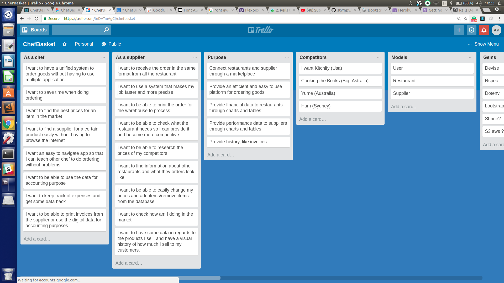
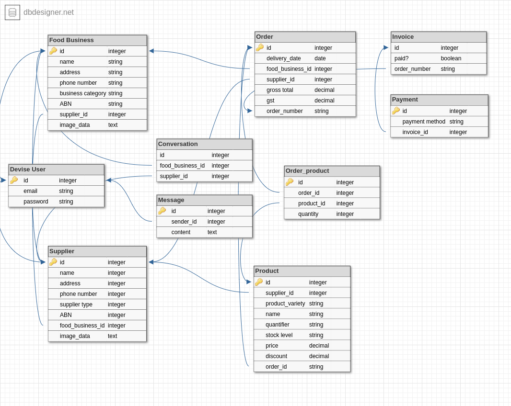

# ChefBasket

### Problem
Ordering goods is a chef daily routine and a task that can be daunting, not only because of the calculations and estimates involved in placing an order, but also because each supplier has got its own ordering system. (sms, email, webapp, voicemail)
The problem resulting by this are:
- Time wasted using multiple systems and keeping track of numbers, emails 
- No records of orders/transactions
- Easy to make mistakes (typos, sending message to the wrong suppliers, etc)
- No confirmation of order received
- No estimate on current order or data in general
- Supplier invoice either printed out or sent by email (two different places, easy to lose)

### Solution
By providing a common portal, restaurants and suppliers can simplify they way they do business and at the same time collect data from orders and transactions to help them make better decisions.
#### The advantages for the restaurants are: 
- A single ordering system for all their suppliers
- Orders cost and history for comparisons (optional weekly estimates and target)
- Real time deals on products (notification on price drops) 
- Order/payments confirmations (option to pay weekly on the following Monday)
- Direct messaging to the supplier (with sms and email notification to supplier)
- Search supplier/item from the database
#### The advantages for the suppliers are:
- Invoicing through the system
- List of restaurants to send offers to
- Compare prices with competitors
- Be notified of new order/ restaurant message
- Holiday notifications/ Discounts through system

### User Stories

### ERD

### User Restaurant
#### My Food Businesses
- View list of businesses owned
- Add or delete businesses
- Access as one of the business
#### Home
- Main navigation
- Order history
- New order
- Suppliers
- Profile
- Search
- Delivery
#### Order history
- Display list of past orders with main details
- View order and perform payment
- Print
#### New order
- Issue new order
- Supplier will receive an email when order has been finalized
#### Suppliers
- List of my suppliers
- Search supplier 
- Add / delete from list
- Check supplier details
- Message supplier
#### Profile
- View/Edit profile
#### Delivery
- View expected delivery
#### Search
- Search Products
- View Products Prices

### Supplier
#### Home
- Main navigation
- Order history
- My clients
- Profile
- Search
- Delivery
#### Order history
- View new orders
- Display list of past orders with main details
- Print order for warehouse use
#### My clients
- List of food businesses
- Search food business
- Add / delete from list
- Check food business details
- Message food business
#### Profile
- View/Edit profile
#### Delivery
- View pending delivery
#### Search
- View Competitors Products Prices

### Models
#### Restaurant
- details
- check suppliers in the system
- check supplier database
- look up for an item in database
- order certain quantities of an item
- place order
- message supplier
- pay supplier
- get confirmation when order is placed
- weekly audit
- transaction history (both goods and payments) 

### Supplier
- upload database (option to label item as out of stock)
- apply discounts
- message restaurants (for deals or out of stock)
- notification of payment from restaurant
- give a credit to restaurant (for returned item or else)

### Problems Encountered
The first problem I had to deal with was to decide how to structure the user model since this application is serving two different user with opposite situations and needs.
- One way was to build two different user with devise
- Another way was to create a sigle User model with polymorphic profile that contains the unique filed needed for the user type
- Single table inheritance
In the end I decided to implement a single devise User with a user_type attribute which allows to create a child Food Business or Supplier.
The main difference between the two is that a user_type Food Business can have a list of food businesses, while a supplier can only have one single account.
The difficulty was to render different views and options using the same controllers and views, and connecting all the links between screens and functionalities.

### Future Implementations
- Issue invoices
- Connect to accounting application
- Print Orders
- Upload products database 